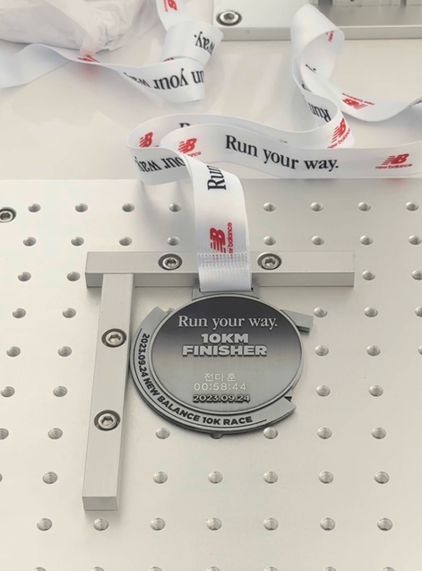

안녕하세요. 피앰아이 개발부 전다훈입니다.

2023 년도 이제 얼마남지 않았네요.
저에게 있어서 올 한 해는 처음 시도한 것들이 많은 한 해였어요. 물론 개발자로써도 큰 성장도 있었구요.

그래서 그런건지 몰라도 정말 시간이 빨리 지나간 것 같아요.

1 년 동안 어떤 일들이 있었는지 큰 카테고리로만 구성하여 정리해 보았습니다.

### 1. 유니서베이를 개발하면서

유니서베이는 제가 맡았던 프로젝트 중에 가장 큰 프로젝트에요.
22년도 부터 시작해서 벌써 맡은 지 1년 반이 넘어갔어요. 길게 맡았던 만큼 다른 프로젝트에 비해 성장한 부분도 많은 것 같아요.

먼저 다른 사람이 작성한 것을 찾아서 읽어 가는 것이 편해졌어요.
처음 시작했을 때는 하나 하나 찾아가며 많은 시간이 걸렸지만 지금은 필요한 부분만 읽고 빠르게 넘어가서 다른 부분에도 적용할 수 있으니깐요.

두 번째는 어색한 사이였던 CSS와 친해진 계기가 되었습니다.
디자인을 바꾸면서 CSS를 다시 그려나가고 또 리팩토링을 하면서 새로운 방식도 넣어보고 하니 금방 친해질 수 있었습니다.
예전에는 새로운 디자인을 보면 한숨만 나왔더라면 이제는 먼저 구조를 그려보고 어떻게 구성하면 되겠다 라는 생각이 먼저 드는 것 같아요.

세 번째는 인증을 위한 작업에서 했던 일들이 좋은 경험으로 다가왔습니다.
깐깐한 요구사항을 보면서 이렇게까지 해야하나 싶었던 것들이 있었지만, 그 덕분에 알아간 것들이 더 많았던 것 같아요.
에레메세지를 어떻게 작성한다던가, 좀 더 보안에 신경써야하는 부분, 그리고 정말 신기했던 건 wireshark로 http 통신을 뜯어본 것, 책에서만 보던 내용을 실제로 보니까 엄청 신기했습니다.ㅎㅎㅎ

(에레메세지라고 해서 관련해서 찾아보니까 거기서 요구했던 내용들이 다 가이드라인에 잡혀있는거 더라구요. 좋은 링크를 찾아서 공유드립니다.)

[에러메세지 가이드라인](https://developers.google.com/tech-writing/error-messages)

마지막으로 좋은건진 모르겠지만.. 배포에 대한 무서움이 생겼습니다.
잦은 수정이 있더라도 사용자가 없을 때는 그냥 수정하고 바로 배포하고 했지만.. 사용자가 조금씩 있고, 또 CS를 봐주는 팀도 따로 있다보니 제가 잘못하여 잘못된 부분이 반영된다면 바로 피드백이와 배포를 할 때 신중해지는 것 같아요. 제 나름 테스트를 했다고는 하지만 늘 어디선가 구멍이 나있더라구요...
그러다보니 브랜치 관리도 왜 해야하는지 뼈저리게 느끼게 되었고.. 심각한 버그가 아닌 이상 배포 일을 미루고 한번에 모아서 하게 되더라구요.  
배포를 하는 중에 컨테이너에 Error 이라는 글자가 뜨면 소름돋습니다..😱😱😱😱😱😱😱😱

### 2. 꾸준한 자기 개발

사실 저는 한 가지만 꾸준하게 하지 못해요. 금방 실증이 나서 다른 걸로 해보거나 새로운 걸 찾아보거나 하거든요.
그래도 개발에 있어서는 꾸준히 자기 개발을 했다고 생각이 들어 꾸준한 자기 개발이라고 표현해 보았습니다.
저는 머리가 좋다고 생각하지 않아요.. 그렇기 때문에 뭐든 다른 사람들 보다 좀 더 많은 시간을 할애하는 편입니다. 그래서 퇴근 후에도 틈틈이 개인 공부를 하고 있습니다. 

개발을 시작하고 나서 부터 지금까지도 사이드 프로젝트를 놓고 있지 않아요. 사이드 프로젝트를 진행해 보면서 궁금했던 것, 제가 회사에서 경험하지 못했 던 것들을 해보면서 좋은게 있다면 업무에도 응용해보고 있습니다.

(진행했던 것 중 실제 배포가 이루어진게 많이 없다는게 아쉬운 점이에요..)

올 해는 개발 관련 스터디도 참여해 보았습니다. 다른 개발자분들과도 스터디를 해보면서 다른 사람들의 생각도 듣고 저에게 부족했던 부분을 보충해가고 있습니다.

(당장 이번 주 부터는 NestJS 스터디를 시작합니다. 😮‍💨)

그리고 같이 스터디를 했던 분들과 함께 개발 관련 컨퍼런스도 참여해 봤습니다. 그 회사에서는 이런 문제에 대해 어떤 식으로 해결하고 있고, 여러 개발자 분들이 모여 이야기를 나누는 정말 좋은 시간이였던 것 같아요. 저희 팀원분들도 여유가 된다면 꼭 참여해보는 것을 추천드려요! 

[meetup](https://www.meetup.com/)

### 3. 개인적인 것

개인적으로도 처음 시도해 보았던게 많았던 해였습니다.

제 첫 마라톤도 23 년에 시작되었네요. 물론 풀 코스를 뛰는 황인호 과장님에 비하면... 저는 애기 걸음마 수준이지만 그래도 10km도 힘들어요 🤣

목표로 했던 10km 1 시간 이내 통과를 이루었습니다.

처음에는 마라톤을 왜 뛰나 싶었는데 막상 그 인파 속 에서 같이 뛰고 있는게 정말 좋은 경험이였어요. 24년에 돌아오는 마라톤도 참여할 예정입니다~!

클라이밍도 처음 해봤다가 양 팔을 못쓰는 경험도 있었어요. 팔에 조금이라도 힘을 주는 순간.. 쥐가 나버려서 그 쉬운 문여는 것 조차.. 힘들었습니다..ㅎㅎㅎ

그 밖에도 처음 먹어보는 음식들도 많았었고, 새로운 친구들도 많이 만났던 해였습니다.

### 4. 아쉬운 점

아쉬운 점이 있다면 올 초해 계획했던 일들이 하나도 지켜지지 않았다라는 점이에요. 매 년 그래왔듯이.. 계획은 계획으로만 그쳤습니다. 하지만 계획을 세우는 일은 늘 설레는 일이니까 다가올 24년도 계획을 세워볼까 합니다.

개발 관련 공부, 업무를 하면서 잘하고 있는 건가 라는 고민을 많이 했었어요. 공부가 됐던 업무가 됐던 저 혼자만의 방식을 추구했는데 이렇게 계속 하다보니 개발팀 내에서 난 뭘 하고 있는 걸까 라는 생각이 들더라구요. 딱히 뭘 해야하는건 아닐테지만 너무 혼자만의 시간을 보낸 것 같아 아쉬웠습니다. 같이 나아갈 수 있는 방향에 대해 고민을 해봐야할것 같아요. 😁

이거 말고는 딱히 아쉬운 점이 많이 없는 재미있는 해였습니다.
내년에도 23년 만큼 재미있는 해였으면 좋겠어요.

