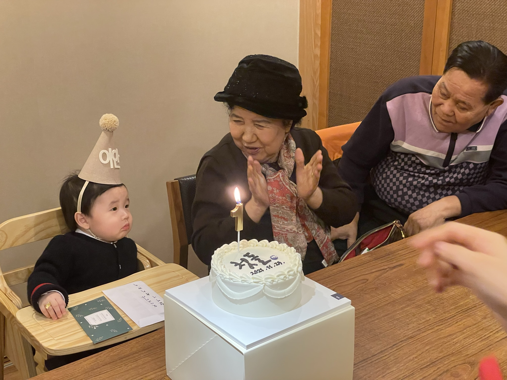
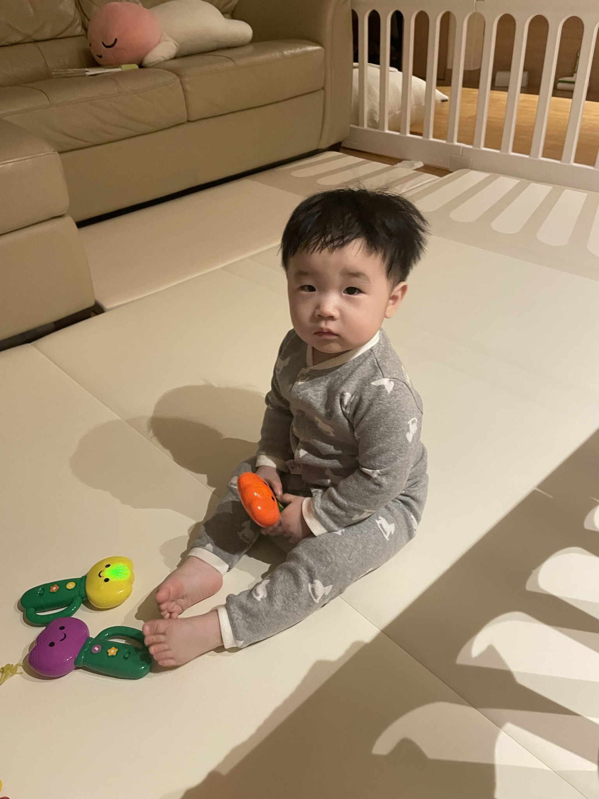
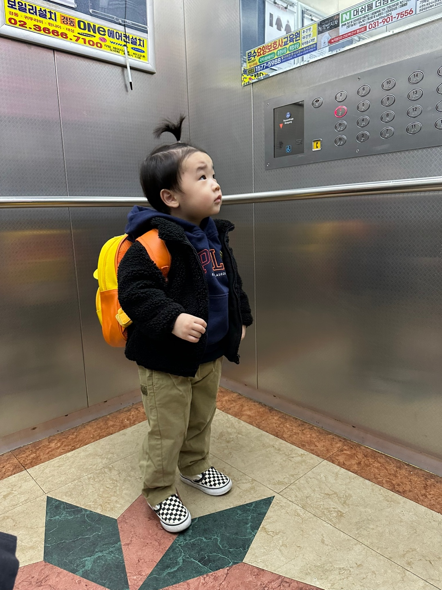
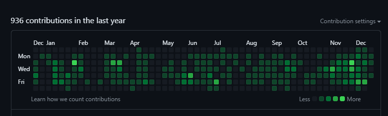
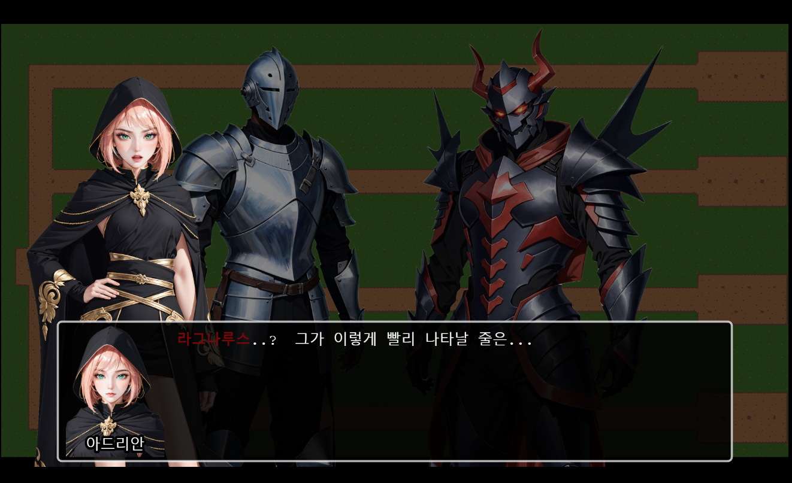
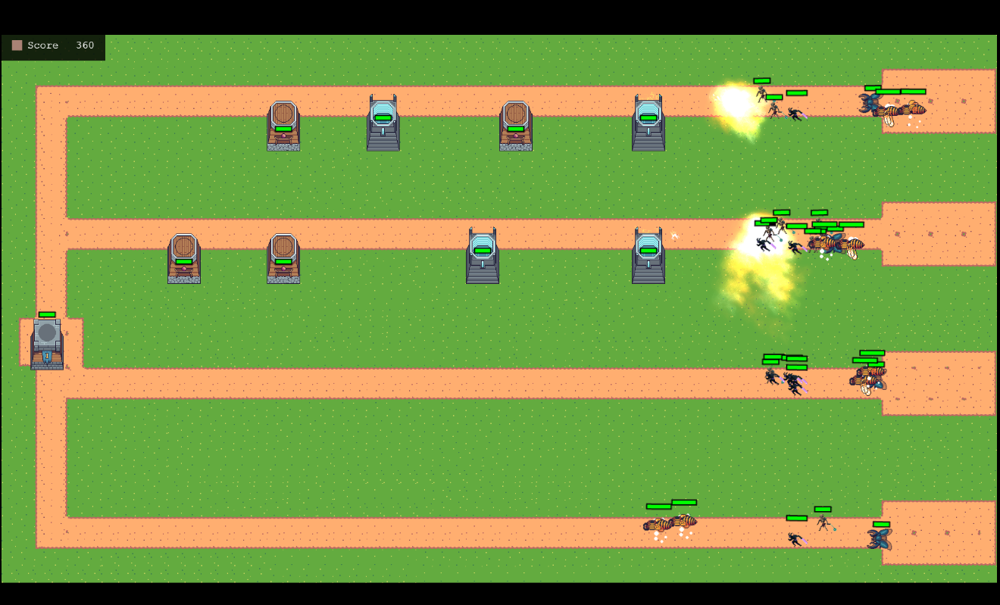

# 2023년을 마무리 하면서  

## 머리말

2023년은 제 인생에 평생 기억될 한 해가 되었습니다.(좋은 쪽으로든 나쁜 쪽으로든)

개인적으로 많은 일들이 있었고, PMI의 직원으로, 팀장으로, 또 개발자로써도 다양한 경험을 했던 것 같습니다.

### 개인사

먼저 개인사를 돌아보도록 하겠습니다.

- 5월 7일, 저희 어머니가 돌아가셨습니다.  
  허리 때문에 병원에 입원하셨고, 퇴원을 몇 일 앞두고 병원에서 갑자기 돌아가셨습니다.  
  감당할 수 없을 슬픔을 겪였지만, 가족들과 대표님, 저를 이해해준 팀원들, 그리고 위로해주셨던 모든 직원분들, 여러분의 진심어린 위로로 많은 힘이 되었습니다.  
  홀로 남으신 아버지가 어머니가 갑자기 돌아가시면서 정신적 / 육체적으로 많이 힘드신 상태였고, 그런 아버지를 저희 집에 모시고 살면서 가족과 함께하는 시간이 더욱 소중해졌습니다.  
  아직도 실감이 많이 안나네요. 평생 가슴에 묻고 살아가겠습니다.
  

- 제 아들 이안이는 올해 11월 2살이 되었습니다.   
    중간에 저혈당으로 잠시 입원을 했던 일 말고는 건강하게 잘 자라고 있습니다.

### 1월

### 12월

- 그리고 돼지가 되었습니다. 역대 최고 체중을 찍고 건강검진에서 비만이라고 계속 언급하더군요. 확신은 못하겠지만
  좀 체중 관리를 해야겠습니다...

## 개발부 구성원으로

PMI 개발부에서 저를 돌아본다면..

contribution만 본다면 꽤 열심히 했네요.

- 팀장으로 다양한 프로젝트에 참여하여 여러가지 역할을 수행했습니다.   
가장 아쉬운 건 팀원들에게 제대로 된 피드백, 코드리뷰를 거의 못 준 점을 꼽겠습니다.

- 좋은 리더가 되었나?
솔직히 모르겠습니다. 이 문제는 여전히 제게 어려운 문제입니다. 언젠간 될 수 있겠죠.. 누가 좀 알려주십쇼
 

- 조직의 리더 역할을 수행한다는 건 여러가지 의미에서 참 힘든 것 같습니다. 특히 개발 조직에서는 더욱 그렇습니다.
다양한 팀원들과 여러 상황에 직면해 해결하는 건 정말 어려운 일이었습니다. 그래도 후반기에 팀이 2개로 나뉘면서 그 어려움이 많이
해서 되지 않았나 싶습니다.

- 기억에 남는 프로젝트 몇 개가 있는데 하나는 "유니서베이 컬렉터"입니다. 최근에 작업해서인지는 몰라도, 항상 생각해왔던 설문 응답 시스템에서
제가 생각하던 백앤드 검증을 이룰 수 있었습니다. 많은 설문 응답 시스템을 보면서 제가 생각하던 대로 개발되었다는 점에서 많은 의미가 있었습니다.

- 다음은 "CAPI 시스템"입니다.
짧은 시간에 web으로 구현된 코드들을 offline 상태로 구현하기 위해 많은 노력을 했습니다. 이게 가능할까 싶었던 상황을 해결했고,
활용했던 electron에 대해 많이 알게 되었다는 점에서 의미가 있었습니다. github를 통해 update를 구현했던 점도 인상 깊었습니다. (전다훈님이 했지만..)

- phaser를 통한 게임 개발도 재밌게 했었습니다. 개인 프로젝트로 진행했지만 코딩하는 시간동안 즐겁게 할 수 있어서 개발자로써의 재미를 찾았던 시간입니다. 

- 이외에도 쿠버네티스의 완전한 활용, svelte를 썼던 경험, nestjs의 깊은 이해 등을 꼽을 수 있겠네요.

### 맺음말

2024년은 PMI의 일원으로, 그리고 한 명의 개발자로 더욱 성장할 수 있는 한 해가 되었으면 좋겠습니다.

새 해에는 모두 행복하시고 건강하세요😀

