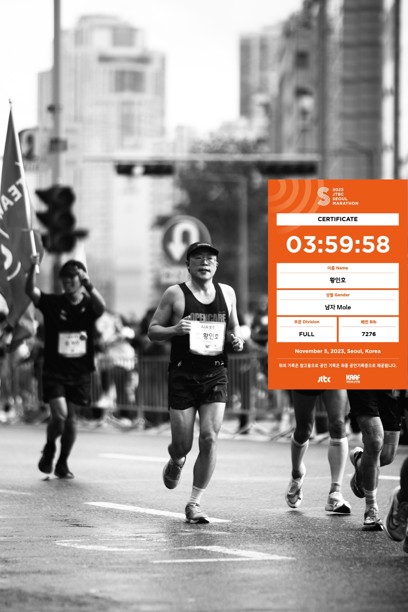

# 2023 회고록

날짜: 2023/12/20

작성자: 황인호

## 2023년 수행 프로젝트

---

- 메타서베이 다운로더 개발 (electron)
- 파일서버 - PNET 연동 유지보수
- RACOI 관련 프로젝트 개발 및 운영 중
    - 국내/외 크롤링
    - 어드민 페이지
    - TV 편성표
    - Auto-ETL(진행 중...)
- 위즈패널 미니게임 개발 (Phaser)

## 힘들었던 점

---

1. 신기술 학습 및 도입
    - Electron이나 Phaser 같이 새로운 기술을 한정된 기한 동안 습득하고 개발에 도입해야 했다.
    - 시간이 제한적이라 제대로 파고들지 못한 부분이 아쉬웠다.
    - 그렇지만 새로운 것을 배우는 것은 도전 정신을 느낄 수 있어 언제나 즐겁다.
>고난은 나를 성장시킨다
2. 프로젝트 기한
    - 예상 일정보다 조금 타이트 하게 잡아야 해서 쉽지 않았다.
    - 그러다 보니 정신이 없어서 신경이 좀 예민할 때가 많았던 것 같다.

## 좋았던 점

---

1. 비교적 자유로운 분위기
    - 말은 잘 없지만 자유로운 환경에서 일할 수 있어서 감사하다.
2. 좋은 사람들
    - 흔히 직장인들 사이에 같이 일하는 동료가 너무 힘들게 한다는 글을 종종 볼 수 있는데 
    개발부는 사람들이 모두 좋다. 아니면 혹시 내가…?

## 개인적인 성취(TMI 대 방출)

---

1. 파이썬 책 1회 완독.  작은, 반복적인 업무에서 조금씩 적용 해보고 있습니다. 
2. 스프링 부트 책 1회 완독.  그냥 까먹지 않기 위해 한번 해봤습니다.
3. 정보처리 기사 필기 합격.  (실기는 일정이 안돼서… ㅠㅠ).
4. Phaser로 위즈패널 이벤트 미니게임 개발로 자신감 상승.  부장님. 서버 세팅 및 배포 도와주셔서 감사합니다.👍  조용빈 주임님. 마무리 잘 해주셔서 감사합니다.🙏
5. 서울 드럼 페스티벌 경연대회 예선 탈락. 😅
6. 작은누나 결혼식 축가.
7. 마라톤 풀코스 완주.

    
    

## 2024년 목표

---

1. 피앰아이 기술스택 개발 공부(Vue3, Nest.js, MongoDB, Docker…) 

- 기초도 탄탄하지 못한 것 같고 아직도 모르는 부분이 많아서 공부할게 넘쳐난다.😥
- 부끄럽지만 Docker를 이제서야 진지하게 찾아보고 로컬 까지만 업로드를 해봤다. 
  2024년에는 배포를 많이 시도 해봐야겠다.

2. 플러터로 앱 출시 해보기(아이디어는 없지만 지금 공부만 하는 중)
3. 게임 만들기(중단했던 디펜스 게임 이어서 개발하기)
4. 수영 중급반 으로 올라가기. (접영 너무 어렵습니다😥)
5. 마라톤 풀코스 기록 단축.