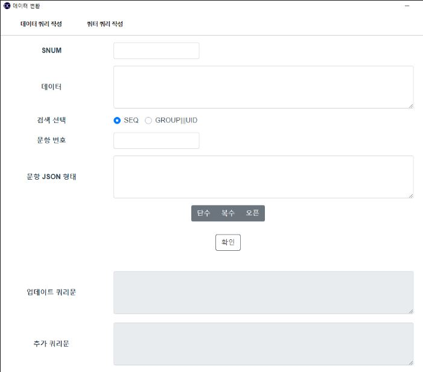

###### MSSQL DB서버
- 회사 서버 DB관련 백업 작업 세팅 작업
- 백업 작업을 시작하는 동시에 DB 백업 -> DB로 복구

  (DB서버 버전이 달라서 복구하는데 호환이 되는지 확인하는 작업)

###### 크롤링 작업들
- 네이버 카페 글 및 댓글
- 해외 사이트 숨피
- 특정 채널 별로 편성표 추출
- 베트남 사이트
 
  페이지별로 필요한 HTML 태그들을 분석하고, 해외 쪽 사이트중에 댓글이 유독 없어 찾는데 힘들어던 기억이 있고 고생 끝에 여러개 댓글 있는 게시글을 찾아서 댓글 추출하는 코드를 작성한 기억이 남습니다.

###### PNet 개선사항 및 프로젝트
- 파일서버 연동 및 PNet 연동하는데 필요한 데이터 추가 작업
- 경영지원부의 정산
- 다운로드 기능 추가
  (PNet 메인 프로젝트 목록에 있는 필터를 통해서 특정 프로젝트들을 받을 수 있도록 기능을 추가)

작업 기간이 큰 프로젝트들을 실사 진행을 하면서 생각 이상으로 추가 및 수정 사항이 발생 추가보다는 수정 사항들이 작업하는데 원인을 분석 하는데 시간을 오래 걸쳐서 문제점을 수정한 점, 그래도 마지막까지 문제 없이 작동될 것 보면 안도하게 되었습니다.

###### data-conversion 프로그램
개인 프로젝트로 시작을 했으나 Meta Survey의 mongoDB 설문 참여 응답 데이터 수정을 위해서 엑셀 파일에 직접 쿼리 문을 작업하는 과정을 생략 하기 위해서 쿼리 문을 생성하는 프로그램을 작성하였습니다.
개발 일정은 2022년 12월 초에 개발을 시작하여 현재 시간까지 꾸준히 업데이트를 진행 하였습니다.
올해에 대략 90% 정도는 해당 프로그램으로 해결되었습니다.
개인적으로는 Meta Survey의 데이터들을 업데이트 하는데 아무런 문제 없이 진행되어 좀 더 편해지고 빠르게 작업이 가능하다는 점들이 좋았습니다.

내년 개인 목표를 electron + phaser, electron 이것 저것을 만들어볼까 합니다. 이상입니다!
