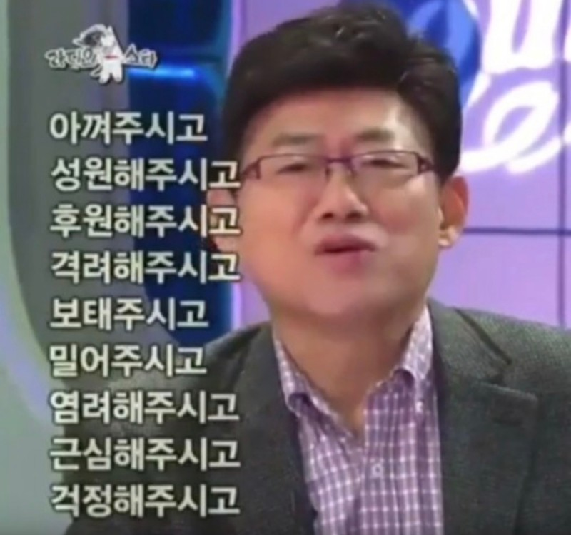

### 안녕하세요.

개발부 사원 심영민입니다. 
시간이 빠르게 흘러 개발이라는 업무를 시작한 지 1년이라는 시간이 흘렀습니다. 
올해는 더욱 다양한 역할로 프로젝트에 참여하여 많은 경험을 했습니다.

### 2023 프로젝트 그리고 리뷰.

#### 홈플러스 웹리포트
웹 리포트 프로젝트에서 처음으로 백엔드 포지션을 맡았습니다. 
RAW 데이터를 가공하여 정제된 산출물을 만드는 과정은 많은 시행착오를 겪었지만 
데이터를 분석하고 정확하고 여러 방면으로 가공하는 법을 배웠습니다.

#### 유니 서베이
유니 서베이 프로젝트에 투입되어 랜딩 페이지에서 Svelt를 사용하며 새로운 언어와 개념에 대해 습득하였습니다. 
또한 설문 화면 작업을 통해 조사 생성, 진행, 종료, 데이터의 구조 등 설문조사 개발에 대한 이해도가 높아졌습니다. 

#### 피앰아이 해피밀

회사 점심 주문 시스템 사이드 프로젝트를 진행하며 직원분들이 사용하며 편리하다  
느끼게 하기 위해 UI, UX에 대해 고민하며 진행하였습니다.  
꾸준한 버전업을 통해서 사내에서 더욱 유용하게 사용될 수 있는 솔루션이 되길 바랍니다. 

#### 웹 대시보드 템플릿
팀원분들께서 범용적으로 사용할 웹 대시보드 템플릿 작업은 시안성과 확장성을 중심으로 작업하였습니다. 
공용으로 사용할 코드를 작업하다 보니 제 코드가 맞는 방법인지 아닌지 확신이 들지는 않아 힘들었지만 
팀원분들께서 사용하시며 더욱 좋은 템플릿으로 발전될 것에 기대가 됩니다.

### 마치며.

    
    

팀에 도움이 될 수 있을까라는 걱정과 달리 2023년 한 해 모두들 편하게 대해주시고 지식을 공유해 주셔서 빠르게 적응하고 업무에 투입할 수 있었습니다. 
어깨너머로 배운다는 말이 있듯 저 역시도 팀원분들의 코드를 보며 많은 도움을 얻고 배울 수 있었습니다. 
처음 경험해 보는 회사 생활에 부족한 점이 많았지만 직급, 결재, 타부서와의 소통 등의 경험을 통해 사회적으로도 더욱 성장할 수 있는 해였습니다. 
감사합니다.
