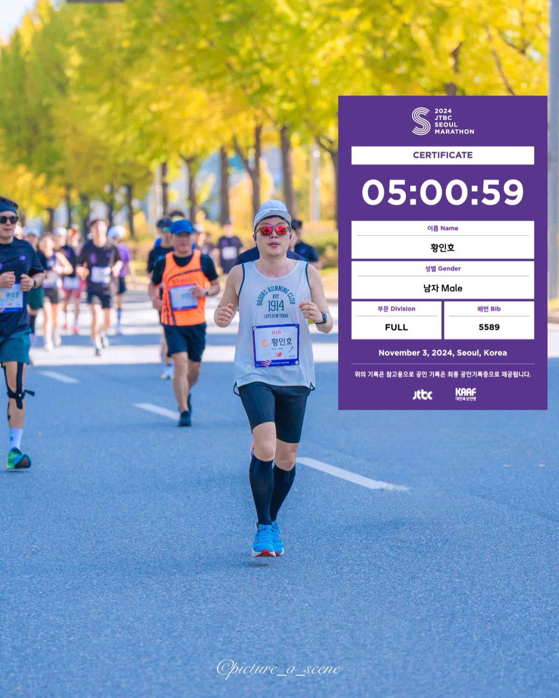

# 2024 회고록

날짜: 2024/12/19

작성자: 황인호

## 2024년 수행 프로젝트

- 크롤링 파티
    - KOBACO - 공익광고 추천을 위한 뉴스 수집
    - KOBACO - 프로그램, 연예앤 댓글 정보 수집
    - 베트남 입찰공고(70개의 공공기관 사이트)
    - 왓챠
- 스타벅스 PPT 보고서 자동화
- -기타 회사 내부 업무지원 프로그램 개발 중
- 일학습병행 기업 현장교사 교육

## 1. 크롤링

크롤링이 너무 많았다...

난이도가 작년엔 튜토리얼이고 올 해는 하드코어 였다고 생각한다.

### 프록시 서버 사용

프록시 서버를 사용하지 않고  네이버 뉴스 크롤링을 돌렸다가 차단당했을 때는

진짜 고소 당하면 어떡하나 잔뜩 쫄아있었는데 다행히 한 달 차단으로 끝났다.😑

### 코드 개선

첫 분기 데이터는 전달 기간이 짧았기도 했고, 작년 코드가 있으니까 혼자 하면 될 거라는 오만한 생각을 가졌다.

구조나 selector 가 바뀐 사이트들이 좀 있었고 프로그램을 돌리는 중 memory 부하로 process가 죽는 현상이 빈번했었다.

작년에도 가끔 뜨긴 했었어서 그냥 많이 오래 돌려서 그런가 싶었는데 코드에 잘못이 있다는 것을 뒤늦게 알아 빠르게 수정을 하니 완전히 사라졌다.

공식 문서를 좀 더 들여다보고 진행했었다면 좋았을텐데 시간에 쫒겨 코드를 복붙하기 바빴던 지난날의 나를 돌이켜보았다.

이젠 어떻게 쓰는지 알았으니 다음번에 잘 해야겠다.

### 여기서 끝이 아니다

작년과 똑같이 수집하면 된다는 키워드에 꽂혀 프로그램명만 수집하면 되는 것으로 착각하고 일정을 짰는데

올해는 **프로그램 명**과 **출연진 이름**, **출연진의 배역 이름** 까지 **X 3 배**를 수집하게 됐다.

나 혼자 감당할 사이즈를 넘어버리는 바람에 _울고싶었다_. 

    
    

다행히도 개발팀 분들의 도움으로 위기를 넘길 수 있었다.

중간에 추석도 있어서 연휴는 웬만하면 문제가 발생하지 않게 하려고 준비했는데

연휴 때 잠깐 뭐 수정한다고 코드를 잘못 고쳤다가 데이터 오류나서 다시 수집하는 어이없는 일도 있었다.

제일 많이 돌렸을 때는 로컬 PC 에서 app 80개 + 가상 서버 10대? 정도까지 분할해서 돌렸던 것 같다.

### 유종의 미?

베트남 관련 입찰공고 크롤링도 진행해야 한다고 하셔서 70개의 사이트 리스트를 빠른 시간내에 완료해야하니 처음 받았을 땐 조금 막막했다.

그나마 다행인 점은 비슷한 구조의 사이트가 10몇개 있어서 url만 바꾸면 되는 소소한 행복이 있었다.

내년에 시간이 된다면 electron + puppteer를 해봐야겠다.

국내 입찰공고 사이트들도 틈틈이 순회를 하며 스크립트를 모두 손봤다.

대략 500개쯤 되니 쉽진 않았다.

마음 같아선 기존 입찰공고 프로그램도 새로 만들고 싶었다.

이것도 electron으로 해볼까 시도는 해봤지만 시간이 없어서 못했었다.

나중에 시간과 기회가 된다면 해봐야지...

### 2025년에도 크롤링?

느낌적인 느낌으로 또 할 것 같은 예감이 든다.

그래도 2년간 경험치를 바탕으로 코드를 많이 고쳐 놨으니

내년에는 좀 더 편하게 돌릴 수 있지 않을까 생각이 든다.

## 2. PPT 자동화

### 스타벅스 PPT 보고서 자동화

처음 최호철 이사님께로부터 받은 코드를 보고 당황스러웠다.

프로그램을 실행하면 PPT 가 중지된다고 하여 확인을 해보니 처음엔 나도 원인은 못 찾겠고

오류 메세지를 구글링을 해도 그럴싸한 답변은 찾지못했다.

하는 수 없이 한 줄씩 디버깅을 하며 문제를 찾다보니 끝까지 실행이 됐었다.

설마 메모리 부하 혹은 누수 같은 문제인가? 하고 대대적인 코드 리팩터링을 진행했다.

이것 저것 성능에 관련되는 문제점들을 건드려보고 라이브러리도 고치고 하니 더이상 중간에 멈추지 않았다.

이 외에도 자잘한 문제들은 있었지만 손이 덜 가게끔 많이 커스텀을 해놔서 처음보단 정말 편리해졌다.(진짜로...😥)

올 해 일회성 프로젝트일지 장기 프로젝트일지 모르겠지만 연구부에서 좋아해주시니 다행이라고 생각한다.

### PPT 자동 생성

이건 중단됐지만 처음엔 PPT를 생성해서 데이터를 넣어주면 되는 것으로만 생각하고있었다.

그러나 실제로 원하셨던 방향성이 상상 이상이라 결국엔 무산됐다.

## 일학습병행 기업현장교사 교육

2025년에 대학생들이 인턴? 개념으로 회사에 들어오는 일학습병행제를 실시한다고 했다.

나라의 지원을 받기 때문에 그 자격에 맞는 교육자도 있어야 하므로

부장님, 차장님, 나 이렇게 기업 현장교사 교육을 받았다.

온라인 교육과 오프라인 교육이 있었는데 온라인 교육은 그냥 보고 듣기만 하면 돼서 큰 문제는 없었다.

그러나 오프라인 교육이 문제였다.

나와 같은, 직장에서 기업현장교사로 선택된 사람들이 2박 3일간 모여 수업을 받는다.

이 때 수업을 들으면서 드는 생각은 드래곤볼에 나오는 시간과 정신의 방에 들어간 느낌이었다.

수업 내용들은 일학습병행 제도와 학생들을 어떻게 가르칠지 등등 이 제도에 대한 전반적인 설명을 듣는건데

짧은 시간 안에 지식들을 주입하려니 정말 머리가 지끈했다.

그나마 좋았던 건 호텔 식사와 간식 무제한 제공 정도?

호텔이 40년 정도 된 건물인데 꽤 많이 낡아있어서 올 해 까지만 운영하고 리모델링 공사를 한다고 했다.

충전기를 콘센트에 꽂았는데 전기가 안 들어와서 전기가 통하는 곳을 한참 찾고,

전등 스위치를 못찾겠어서 포기하고 침침한 저녁을 보냈었다.(나중에 알았는데 전화기 같은게 전등 스위치 패널이었다.)

그래도 양재천이랑 가까워서 산책하기는 정말 좋았다.

기업현장교사 교육도 기본 과정과 심화과정이 있어서 나는 이왕 한 김에 심화과정까지 마무리 했다.

## 그리고 현재 진행중인 회사 내부 업무지원 프로젝트들...

DC팀 견적&미수금 관리는 오픈은 했고 유지보수 과정을 거치고 있다.

거의 엑셀을 웹으로 이식한 것 같은 요청사항들이 있어서 협의를 하고 수정과정을 거치고 있다.

나름 머리를 굴리고 GPT 한테도 많이 물어보고 해서 나쁘진 않은 것 같지만 만들어 놓고 더 불편해서 안 쓰실까봐 그것대로 걱정이다.

나는 데이터 구조랑 이런것만 신경쓰면 되는데 화면을 담당하는 용빈 대리가 고생이 정말 많다.

정성조사 ADMIN도 준비 중이긴 한데 아직 기획서를 받지 못해서 킵 해두고 있다.

이에 항상 퇴근 시간이 좀 늦어져서 내년엔 9시 반 출근으로 바꿔야겠다.

## 2024년 Todo list

1. **피앰아이 기술스택 개발 공부(Vue3, Nest.js, MongoDB, Docker…) ⌛**
   
   피앰아이의 Main Frontend 기술이 Vue 에서 Next.js로 바뀌었기 때문에 새로운 문물에 적응을 하는 중이다.
    
   Vue가 정말 쉬웠다는걸 많이 느낀다.

2. **플러터로 앱 출시 해보기(아이디어는 없지만 지금 공부만 하는 중) ❌**    
   
    이것도 연 초에 잠깐 해보고 바빠서 끝까지 해보진 못했다.
3. **게임 만들기 ❌**    
   
    이것도 연 초에 의욕만 불 탔다가 바빠서 식었다. 😥

4. **수영 중급반 으로 올라가기 ⭕**

   중급반으로 등업 성공해서 영법은 다 배웠지만 자세 교정이 쉽지 않다.

   하지만 더 힘든건 수강신청이다.

   수강신청 성공하면 장거리 연습도 해야겠다.

5. **마라톤 풀코스 기록 단축 ❌**

   4월 쯤 무리한 운동 스케줄로 면역력이 약해져 대상포진이 걸리는 바람에 상반기는 그대로 날렸다.  
   
   하반기에는 대상포진의 스노우볼로 발바닥 부상과 잦은 야근으로 인해 연습을 하나도 못했다.  

   하프 이후에 탈진해서 전철을 탈까 말까 수백번 고민했다. 
  
   포기하고 싶진 않아서 걷뛰로 결국 5시간 걸려서 완주했다. 
 
   정말 힘들었다...

    

        
    

6. **정보처리기사 취득**    

    작년엔가 필기 합격 후 미루고 미뤄왔던 실기시험이 올 해가 마지막 유예기간이라 

    아파서 운동을 쉬는 기간에 틈 나는대로 공부를 해서 2회차에 자격증 취득에 성공했다.

    코딩문제가 좀 더럽게 나와서 치사하긴 했지만 합격 했으니 한잔해.

## 2025년 Todo list
1. 개발 공부(Next.js, Nest.js, MongoDB, etc...)
2. 뭐라도 서비스 하나 만들어보기
3. 운동 하려고 건강하자...

<h1>끝!</h1>